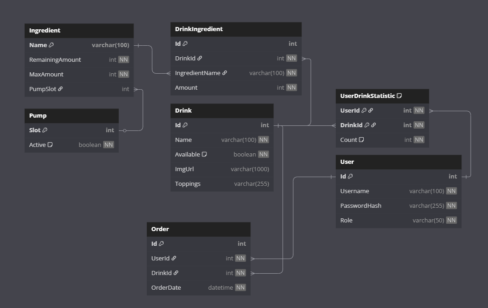

# Projektantrag - Hula Swirl

## 1. Teammitglieder
* Moritz Bernhofer
* Caroline Hornhuber
* Leo Oberndorfer

## 2. Ausgangslage

### 2.1 Ist-Situation
Stellen wir uns vor, wir sind auf einer Sommerparty und möchten das perfekte Erfrischungsgetränk oder den perfekten Smoothie mischen. Aktuell muss man das per Hand machen oder Mischgeräte mieten, die teils über 400€ kosten. Per Hand können dann auch aufgrund von ungenauen Mengenangaben ungenießbare Smoothies zustande kommen. 

### 2.2 Verbesserungspotenziale
Es besteht ein Bedarf an einer automatischen Mischmaschine, mit der man über ein Interface automatisch perfekte Getränke herstellen kann, um Zeit und Geld zu sparen. Es erscheinen oft neue Rezepte, die man erst "lernen" muss, bevor man sie zu einem Geschmackserlebnis umsetzen kann. Daher wäre eine automatische Rezeptfunktion auf einem Interface sehr nützlich.

## 3. Zielsetzung
Da wir selbst nicht gut im manuellen Getränkemischen sind, wollen wir den "Hula Swirl" entwickeln. Der "Hula Swirl" ist ein automatischer Getränkemischer, der 10 flüssige Zutaten halten kann und damit die perfekten Erfrischungsgetränke oder Smoothies in den richtigen Mengen zubereitet. Über eine Web-App teilt man dem Gerät mit, welches Getränk man möchte.

### 3.1 Skizze

### 3.2 Schaltplan

## 4. Chancen und Risiken

### 4.1 Risiken
* **Zeitrisiko:** Es besteht die Möglichkeit, dass wir es in den zwei Jahren nicht schaffen, ein fertiges, funktionierendes Produkt zu erstellen.
* **Verwertbarkeitsrisiko:** Das Risiko besteht, dass das finale Produkt sehr unhandlich und unpraktisch wird.
* **Technisches Realisierungsrisiko:** Es könnte während der Produktion zu technischen Herausforderungen wie Problemen mit den Pumpen, der Stromversorgung oder der Verbindung mit der Web-App kommen. Außerdem könnte unser Budget für das Projekt nicht ausreichen.

### 4.2 Chancen
Der "Hula Swirl" bietet großes Marktpotenzial als automatisiertes Getränkemischgerät für private Anwender und kleinere Events. Die smarte, anpassbare Technik passt gut in moderne Haushalte und könnte durch Updates oder neue Funktionen erweitert werden, was das Nutzerinteresse zusätzlich steigern dürfte.

## 5. User Stories
### 1. User Story: Als Nutzer will ich mir ein Getränk über die Web-App auslassen können.
- **Beschreibung:** Der Nutzer kann über die Web-App ein Getränk auswählen und es mischen lassen.
- **Akzeptanzkriterien:**
  - Die Web-App zeigt eine Liste verfügbarer Getränke an.
  - Der Nutzer kann ein Getränk auswählen und mit einem Klick den Mischvorgang starten.
  - Der Nutzer kann die Details / Inhalte dieses Rezepts sehen
  - Der "Hula Swirl" beginnt automatisch mit der Zubereitung.
- **Technische Anforderungen:**
  - Echtzeitkommunikation zwischen Web-App und Mischgerät.
  - Stabile API-Schnittstelle für Befehle und Statusupdates.

### 2. User Story: Als Gastgeber will ich meine verfügbaren Zutaten eingeben können, damit ich weiß, welche Getränke gemischt werden können.
- **Beschreibung:** Der Gastgeber gibt die aktuell verfügbaren Zutaten in der Web-App ein, sodass die App die passenden Rezepte anzeigt.
- **Akzeptanzkriterien:**
  - Eine Übersichtsliste zeigt alle Zutaten von allen Rezepten an
  - Der Gastgeber kann Zutaten als "Leer" makieren, sodass Rezepte, die diese benötigen nicht mehr angezeigt werden.
  - Die Liste der auswählbaren Getränke wird automatisch aktualisiert.
- **Technische Anforderungen:**
  - Datenbank zur Speicherung der verfügbaren Zutaten.
  - Dynamische Filterfunktion für Rezepte basierend auf den eingegebenen Zutaten.

### 3. User Story: Als Admin will ich neue Getränke zur Auswahl hinzufügen können. Auch will ich die Optionen löschen oder bearbeiten können.
- **Beschreibung:** Der Admin kann Rezepte hinzufügen, löschen oder bearbeiten.
- **Akzeptanzkriterien:**
  - Der Admin kann über die Web-App ein neues Getränkerezept erstellen und speichern.
  - Bestehende Rezepte können editiert, verborgen oder entfernt werden.
- **Technische Anforderungen:**
  - Backend-Funktionalität für CRUD (Create, Read, Update, Delete) von Rezepten.
  - Benutzerrollenverwaltung (Admin-Rechte).

### 4. User Story: Als Admin will ich eine Statistik haben, die zeigt, welche Getränke am meisten bestellt werden.
- **Beschreibung:** Eine Statistikfunktion gibt dem Admin Einblick, welche Getränke am häufigsten verwendet wurden.
- **Akzeptanzkriterien:**
  - Ein Graph zeigt die Anzahl der Bestellungen pro Stunde.
  - Es gibt eine all time most ordered Liste.
- **Technische Anforderungen:**
  - Tracking- und Logging-Funktion für Getränkebestellungen.
  - Visualisierungsbibliothek für Diagramme und Tabellen.

## 6. Web-App

### 6.1 GUI-Mockups
[Figma](https://www.figma.com/design/Kv5zzkLDU8AcD5gaHvIsNp/HulaSwirl?node-id=3-4&t=TftDCDX82oTWYwnj-1)

### 6.2 Url Pfade zu den Mockups

/Home				1.0\
/Home/{Recipe_id}		1.4\
/Admin/Recipes			2.0	\
/Admin/Recipes/{Recipe_id}	2.2\
/Admin/Ingredients		3.0\
/Admin/Statistics		4.0

### 6.3 ERD Diagramm

## 7. Kostenschätzung

- Etwa 130€ für den Protoyp (Amazon Prime Day berücksichtigt)
- Ca. 200€ für das Endprodukt
